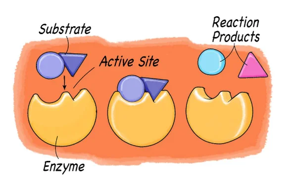

    

# POC Protein Feature Extraction

This repository contains the code for the prediction of `Kcat`. This project is a Proof of Concept for my thesis. The main goal is to use different regression models on the dataset created by the Fondant pipeline. The feature that has been predicted is the `Kcat` feature.

- [POC Protein Feature Extraction](#poc-protein-feature-extraction)
  - [Goal](#goal)
  - [What is `Kcat`, `Km`, and `Vmax`](#what-is-kcat-km-and-vmax)
  - [Dataset](#dataset)
  - [Models](#models)
  - [Model Results](#model-results)
    - [with `Km` and `Vmax`](#with-km-and-vmax)
    - [without `Km` and `Vmax`](#without-km-and-vmax)

## Goal

The goal of this Proof of Concept is to predict the `Kcat` feature using different regression models and features extracted by the Fondant pipeline. With this Proof of Concept also wanted to know what the influence of the `Km` and `Vmax` features are on the prediction of the `Kcat` feature.

## What is `Kcat`, `Km`, and `Vmax`

`Kcat` is the turnover number of an enzyme. It is the number of substrate molecules converted to product per enzyme molecule per unit time. `Km` is the Michaelis constant, which is the concentration of the substrate at which the reaction rate is half of `Vmax`. `Vmax` is the maximum rate of an enzyme-catalyzed reaction.

[source](https://igbiologyy.blogspot.com/2021/05/51-enzymes.html)

The thesis goes more into depth about these features and how they are calculated.

## Dataset

The dataset is created by the Fondant pipeline in the [fondant-pipeline](./fondant-pipeline/) folder. The pipeline uses protein sequences from [a dataset](https://www.uniprot.org/uniprotkb?query=cyp) to apply certain components to extract features from this protein sequences. This pipeline needs to be run first before the models can be trained. The data after the pipeline has been run can be found in the [fondant-pipeline data](./fondant-pipeline/data/) folder.

## Models

The models have been trained on the dataset created by the Fondant pipeline. The models that have been used are:

- Polynomial Regression
- K-Nearest Neighbors Regressor
- Random Forest Regressor
- Gradient Boosting Regressor
- Extreme Gradient Boosting Regressor

The models are trained, but not saved in this repository.

The notebooks where the models were trained with and without the `Km` and `Vmax` features can be found here:

- [Kcat prediction with Km and Vmax](./prediction.ipynb)
- [Kcat prediction without Km and Vmax](./prediction_without_km_vmax.ipynb)

## Model Results

The models were trained first and foremost to predict the `Kcat` feature using the features extracted by the Fondant pipeline.

### with `Km` and `Vmax`

Model train and validation results:

Model test results:

### without `Km` and `Vmax`

Model train and validation results:

Model test results:

As you can see the models don't perform better with or without the `Km` and `Vmax` features. They don't have any influence on the prediction of the `Kcat` feature.
